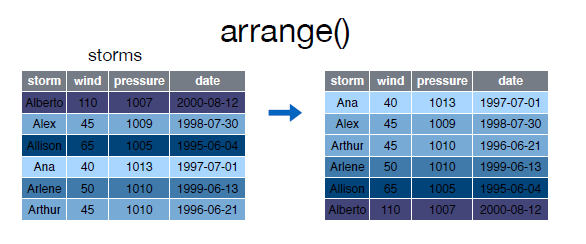
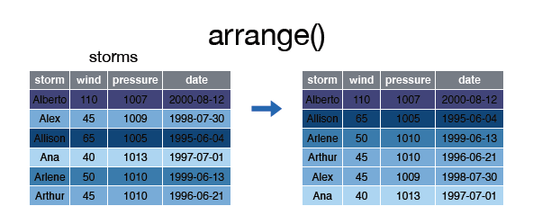
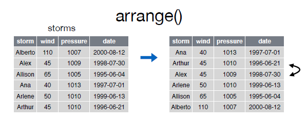

```{r knitsetup, echo=FALSE, results='hide', warning=FALSE, message=FALSE, cache=FALSE}
opts_knit$set(base.dir='./', fig.path='', out.format='md')
opts_chunk$set(prompt=TRUE, comment='', results='markup')
# See yihui.name/knitr/options for more Knitr options.
##### Put other setup R code here


# end setup chunk
```
# arrange()

La función __arrange()__ se utiliza para ordenar las filas de un data frame de acuerdo a una o varias columnas/variables.  


Por defecto __arrange()__ ordena las filas por orden ascendente:  

  

Echemos un vistazo al data frame __arrange__:


```{r}

storms


```  

Para ordenar las filas por la variable __wind__ de forma ascendente podemos hacer lo siguiente:  

```{r}
arrange(storms, wind)

```

  
Si las queremos ordenar de forma ascendente lo haremos del siguiente modo:  

  


```{r}
arrange(storms, desc(wind))

```  


Podemos ordenar las filas según varias variables:  

  


```{r}
storms
arrange(storms, wind, date)

```

