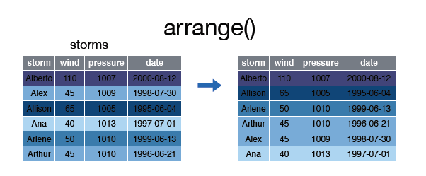

# arrange()

La función __arrange()__ se utiliza para ordenar las filas de un data frame de acuerdo a una o varias columnas/variables.  


Por defecto __arrange()__ ordena las filas por orden ascendente:  

  

Echemos un vistazo al data frame __arrange__:


```r
> storms
```

```
Source: local data frame [6 x 4]

    storm  wind pressure       date
    (chr) (int)    (int)     (date)
1 Alberto   110     1007 2000-08-03
2    Alex    45     1009 1998-07-27
3 Allison    65     1005 1995-06-03
4     Ana    40     1013 1997-06-30
5  Arlene    50     1010 1999-06-11
6  Arthur    45     1010 1996-06-17
```

Para ordenar las filas por la variable __wind__ de forma ascendente podemos hacer lo siguiente:  


```r
> arrange(storms, wind)
```

```
Source: local data frame [6 x 4]

    storm  wind pressure       date
    (chr) (int)    (int)     (date)
1     Ana    40     1013 1997-06-30
2    Alex    45     1009 1998-07-27
3  Arthur    45     1010 1996-06-17
4  Arlene    50     1010 1999-06-11
5 Allison    65     1005 1995-06-03
6 Alberto   110     1007 2000-08-03
```

  
Si las queremos ordenar de forma ascendente lo haremos del siguiente modo:  

  


```r
> arrange(storms, desc(wind))
```

```
Source: local data frame [6 x 4]

    storm  wind pressure       date
    (chr) (int)    (int)     (date)
1 Alberto   110     1007 2000-08-03
2 Allison    65     1005 1995-06-03
3  Arlene    50     1010 1999-06-11
4    Alex    45     1009 1998-07-27
5  Arthur    45     1010 1996-06-17
6     Ana    40     1013 1997-06-30
```


Podemos ordenar las filas según varias variables:  

  


```r
> storms
```

```
Source: local data frame [6 x 4]

    storm  wind pressure       date
    (chr) (int)    (int)     (date)
1 Alberto   110     1007 2000-08-03
2    Alex    45     1009 1998-07-27
3 Allison    65     1005 1995-06-03
4     Ana    40     1013 1997-06-30
5  Arlene    50     1010 1999-06-11
6  Arthur    45     1010 1996-06-17
```

```r
> arrange(storms, wind, date)
```

```
Source: local data frame [6 x 4]

    storm  wind pressure       date
    (chr) (int)    (int)     (date)
1     Ana    40     1013 1997-06-30
2  Arthur    45     1010 1996-06-17
3    Alex    45     1009 1998-07-27
4  Arlene    50     1010 1999-06-11
5 Allison    65     1005 1995-06-03
6 Alberto   110     1007 2000-08-03
```

