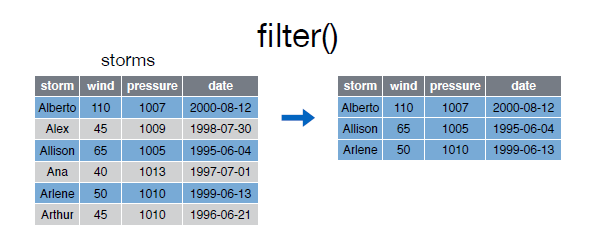
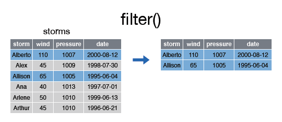

```{r knitsetup, echo=FALSE, results='hide', warning=FALSE, message=FALSE, cache=FALSE}
opts_knit$set(base.dir='./', fig.path='', out.format='md')
opts_chunk$set(prompt=TRUE, comment='', results='markup')
# See yihui.name/knitr/options for more Knitr options.
##### Put other setup R code here


# end setup chunk
```
# filter()

La función __filter__ nos permite filtrar filas según una condición:  


  


```{r}
filter(storms, wind >= 50)

```  


Se pueden incluir varias condiciones en un mismo filtro: 


  


```{r}
filter(storms, wind >= 50, storm %in% c("Alberto", "Alex", "Allison"))

```  


  
  
Las condiciones pueden ser expresiones logicas construidas mediante los operadores relacionales y lógicos:  


|     |  ?Comparison |
| :---: | :---: |
| < | Menor que |
| > | Mayor que |
| == | Igual que |
| <= | Menor o igual que |
| >= | Mayor o igual que |
| != | Diferente que |
| %in% | Pertenece al conjunto |
| is.na | Es NA |
| !is.na | No es NA |  


|      | ?base::Logic |
| :---: | :---: |
| & | boolean and |
| \|  boolean o |
| xor | or inclusivo |
| ! | not |
| any | cualquiera true |
| all | todos verdaderos |  


Así por ejemplo, el siguiente ejemplo filtra aquellas filas con un __wind >= 50__ y __pressure < 1010__:  


```{r}

filter(storms, wind>=50 & pressure<1010)

```  


