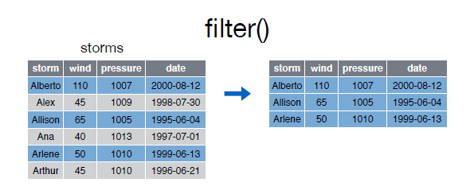
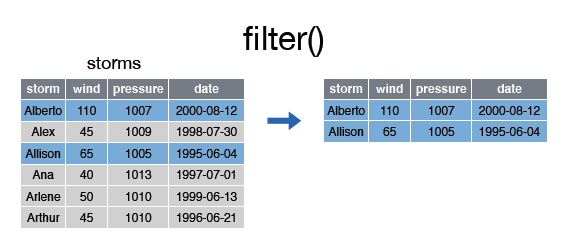

# filter()

La función __filter__ nos permite filtrar filas según una condición:  


  


```r
> filter(storms, wind >= 50)
```

```
Source: local data frame [3 x 4]

    storm  wind pressure       date
    (chr) (int)    (int)     (date)
1 Alberto   110     1007 2000-08-03
2 Allison    65     1005 1995-06-03
3  Arlene    50     1010 1999-06-11
```


Se pueden incluir varias condiciones en un mismo filtro: 


  


```r
> filter(storms, wind >= 50, storm %in% c("Alberto", "Alex", "Allison"))
```

```
Source: local data frame [2 x 4]

    storm  wind pressure       date
    (chr) (int)    (int)     (date)
1 Alberto   110     1007 2000-08-03
2 Allison    65     1005 1995-06-03
```


  
  
Las condiciones pueden ser expresiones logicas construidas mediante los operadores relacionales y lógicos:  


|     |  ?Comparison |
| :---: | :---: |
| < | Menor que |
| > | Mayor que |
| == | Igual que |
| <= | Menor o igual que |
| >= | Mayor o igual que |
| != | Diferente que |
| %in% | Pertenece al conjunto |
| is.na | Es NA |
| !is.na | No es NA |  


|      | ?base::Logic |
| :---: | :---: |
| & | boolean and |
| \|  boolean o |
| xor | or inclusivo |
| ! | not |
| any | cualquiera true |
| all | todos verdaderos |  


Así por ejemplo, el siguiente ejemplo filtra aquellas filas con un __wind >= 50__ y __pressure < 1010__:  


```r
> filter(storms, wind>=50 & pressure<1010)
```

```
Source: local data frame [2 x 4]

    storm  wind pressure       date
    (chr) (int)    (int)     (date)
1 Alberto   110     1007 2000-08-03
2 Allison    65     1005 1995-06-03
```


