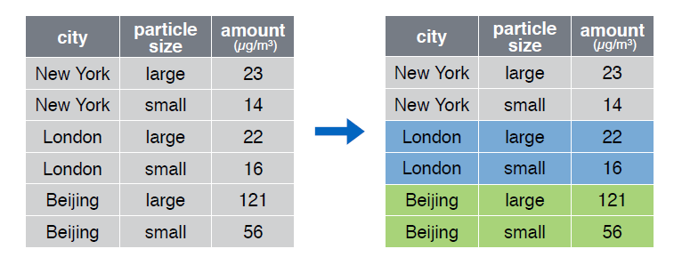
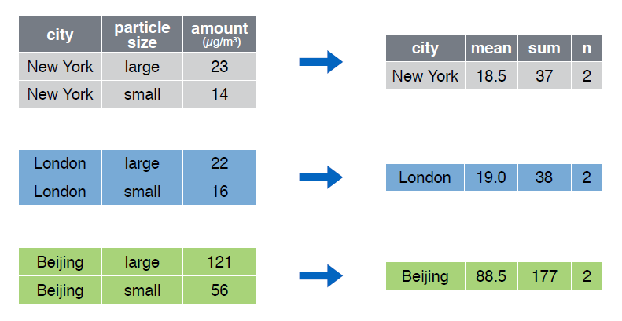

```{r knitsetup, echo=FALSE, results='hide', warning=FALSE, message=FALSE, cache=FALSE}
opts_knit$set(base.dir='./', fig.path='', out.format='md')
opts_chunk$set(prompt=TRUE, comment='', results='markup')
# See yihui.name/knitr/options for more Knitr options.
##### Put other setup R code here


# end setup chunk
```
# group_by()

La función __group_by()__  agrupa un conjunto de filas seleccionado en un conjunto de filas de resumen de acuerdo con los valores de una o más columnas o expresiones.

  

Echemos un vistazo al data frame __pollution__:

```{r}
pollution

```  

Agrupemos las observaciones por la variable __city__:  

```{r}
group_by(pollution, city)


```  
  
  


La función __group_by()__ es extremadamente útil trabajando en conjunción con la función __summarise()__:  


  


```{r}
pollution %>%  group_by(city) %>% 
  summarise(mean = mean(amount), sum = sum(amount), n = n())

```

