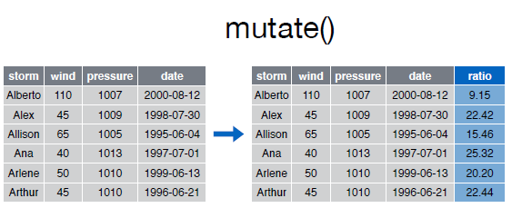
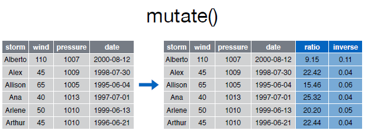

# mutate()

Con la función __mutate()__ podemos computar tranformaciones de variables en un data frame. A menudo, tendremos la necesidad de crear nuevas variables que se calculan a partir de variables existentes,__mutate()__ nos proporciona una interface clara para realizar este tipo de operaciones.  


Así por ejemplo si deseamos calcular el ratio entre _pressure_ y _wind_:  
  

Echemos un vistazo al data frame __storms__:


```r
> storms
```

```
Source: local data frame [6 x 4]

    storm  wind pressure       date
    (chr) (int)    (int)     (date)
1 Alberto   110     1007 2000-08-03
2    Alex    45     1009 1998-07-27
3 Allison    65     1005 1995-06-03
4     Ana    40     1013 1997-06-30
5  Arlene    50     1010 1999-06-11
6  Arthur    45     1010 1996-06-17
```

A continuación podemos crear una nueva varible __ratio__ con el ratio entre la presión y el viento:  


```r
> mutate(storms, ratio = pressure/wind)
```

```
Source: local data frame [6 x 5]

    storm  wind pressure       date     ratio
    (chr) (int)    (int)     (date)     (dbl)
1 Alberto   110     1007 2000-08-03  9.154545
2    Alex    45     1009 1998-07-27 22.422222
3 Allison    65     1005 1995-06-03 15.461538
4     Ana    40     1013 1997-06-30 25.325000
5  Arlene    50     1010 1999-06-11 20.200000
6  Arthur    45     1010 1996-06-17 22.444444
```


La función __mutate()__ nos permite encadenar varias expresiones en una misma sentencia: 

  


```r
> mutate(storms, ratio=pressure/wind, inverse=ratio^-1)
```

```
Source: local data frame [6 x 6]

    storm  wind pressure       date     ratio    inverse
    (chr) (int)    (int)     (date)     (dbl)      (dbl)
1 Alberto   110     1007 2000-08-03  9.154545 0.10923535
2    Alex    45     1009 1998-07-27 22.422222 0.04459861
3 Allison    65     1005 1995-06-03 15.461538 0.06467662
4     Ana    40     1013 1997-06-30 25.325000 0.03948667
5  Arlene    50     1010 1999-06-11 20.200000 0.04950495
6  Arthur    45     1010 1996-06-17 22.444444 0.04455446
```


Podemos utilizar funciones de otros paquetes como resultado de una nueva columna/variable, así por ejemplo si queremos calcular la _distribución de frecuencias absolutas acumuladas_ de la variable _wind_ podríamos utilizar la función _cumsum()_ del paquete _bas_:  


```r
> mutate(storms, freq.acumulative = cumsum(wind))
```

```
Source: local data frame [6 x 5]

    storm  wind pressure       date freq.acumulative
    (chr) (int)    (int)     (date)            (int)
1 Alberto   110     1007 2000-08-03              110
2    Alex    45     1009 1998-07-27              155
3 Allison    65     1005 1995-06-03              220
4     Ana    40     1013 1997-06-30              260
5  Arlene    50     1010 1999-06-11              310
6  Arthur    45     1010 1996-06-17              355
```


