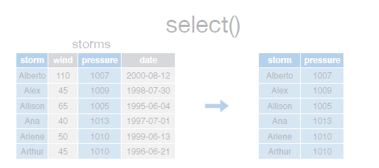
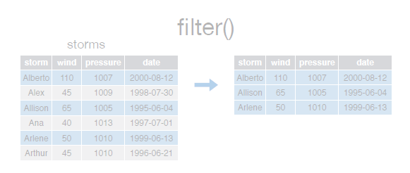
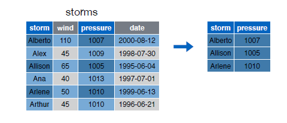
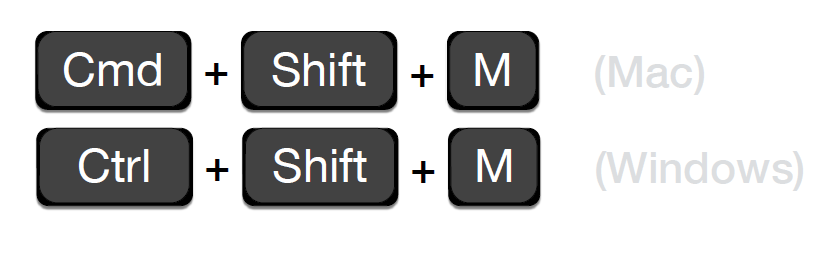

## El operador pipe %>%

El operador pipeline __%>%__ es útil para concatenar múltiples _dplyr_ operaciones. Obsérvese en el siguiente ejemplo, que cada vez que queremos aplicar mas de una función, la instrucción es una secuencia de llamadas a funciones de forma anidada y que resulta ilegible:  


```{r eval=FALSE}
third(second(first(x)))

```  


Este anidamiento no es una forma natural de expresar un secuencia de operaciones. El operador __%>%__ nos permite escribir una secuencia de operaciones de izquierda a derecha:  


```{r eval=FALSE}
first(x) %>% second(x) %>% third(x)
```  


Obsérvese que las siguientes instrucciones, 

  

  


```{r}

select(storms, storm, pressure)
filter(storms, wind >= 50)

```  


es lo mismo que,  


```{r}
storms %>% select(storm, pressure)
storms %>% filter(wind >= 50)
```  


Es en el siguiente ejemplo donde podemos observar el verdadero potencial del operador pipeline:  

  


```{r}
storms %>%
  filter(wind>=50) %>%
  select(storm, pressure)

```  

  
  

> El atajo de teclado para el operador __%>%__ es  



