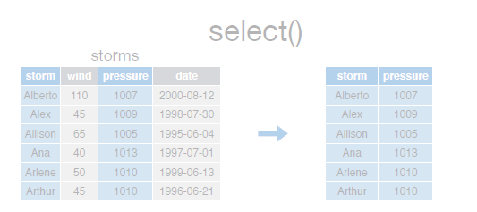
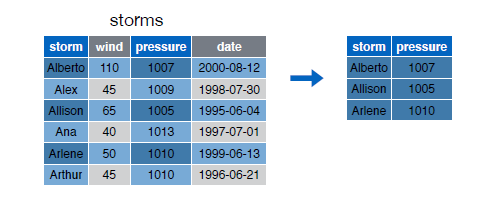

## El operador pipe %>%

El operador pipeline __%>%__ es útil para concatenar múltiples _dplyr_ operaciones. Obsérvese en el siguiente ejemplo, que cada vez que queremos aplicar mas de una función, la instrucción es una secuencia de llamadas a funciones de forma anidada y que resulta ilegible:  


```r
third(second(first(x)))
```


Este anidamiento no es una forma natural de expresar un secuencia de operaciones. El operador __%>%__ nos permite escribir una secuencia de operaciones de izquierda a derecha:  


```r
first(x) %>% second(x) %>% third(x)
```


Obsérvese que las siguientes instrucciones, 

  

  


```r
select(storms, storm, pressure)
```

```
## Source: local data frame [6 x 2]
## 
##     storm pressure
##     (chr)    (int)
## 1 Alberto     1007
## 2    Alex     1009
## 3 Allison     1005
## 4     Ana     1013
## 5  Arlene     1010
## 6  Arthur     1010
```

```r
filter(storms, wind >= 50)
```

```
## Source: local data frame [3 x 4]
## 
##     storm  wind pressure       date
##     (chr) (int)    (int)     (date)
## 1 Alberto   110     1007 2000-08-03
## 2 Allison    65     1005 1995-06-03
## 3  Arlene    50     1010 1999-06-11
```


es lo mismo que,  


```r
storms %>% select(storm, pressure)
```

```
## Source: local data frame [6 x 2]
## 
##     storm pressure
##     (chr)    (int)
## 1 Alberto     1007
## 2    Alex     1009
## 3 Allison     1005
## 4     Ana     1013
## 5  Arlene     1010
## 6  Arthur     1010
```

```r
storms %>% filter(wind >= 50)
```

```
## Source: local data frame [3 x 4]
## 
##     storm  wind pressure       date
##     (chr) (int)    (int)     (date)
## 1 Alberto   110     1007 2000-08-03
## 2 Allison    65     1005 1995-06-03
## 3  Arlene    50     1010 1999-06-11
```


Es en el siguiente ejemplo donde podemos observar el verdadero potencial del operador pipeline:  

  


```r
storms %>%
  filter(wind>=50) %>%
  select(storm, pressure)
```

```
## Source: local data frame [3 x 2]
## 
##     storm pressure
##     (chr)    (int)
## 1 Alberto     1007
## 2 Allison     1005
## 3  Arlene     1010
```

  
  

> El atajo de teclado para el operador __%>%__ es  


    
