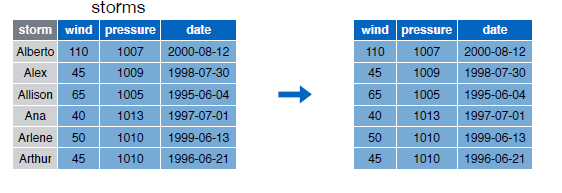
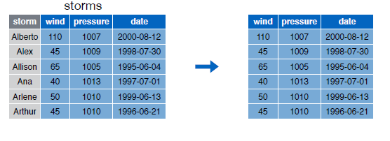
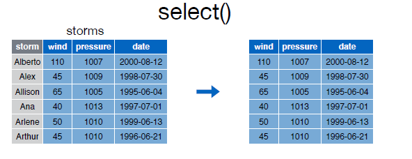

# select()

Lo primero sera instalar el paquete con el conjunto de datos que utilizaremos para los ejemplos:  


```{r eval=FALSE}
install.packages("devtools")
devtools::install_github("rstudio/EDAWR")

```  


Tendremos que cargar la libreria para poder utilizarla:  


```{r eval=FALSE}
library(EDAWR)

```  


Podemos echar un vistazo al conjunto de datos mediante __?__ or el comando __Viem()__:  


```{r eval=FALSE}
?storms
?cases
?pollution
?tb
View(storms)
View(cases)
View(pollution)
View(tb)
```  


Con la función select podemos seleccionar columnas de un data frame:  


  

Visualizamos el contenido del data frame __storms__:


```{r}
storms

```  

Para seleccionar las variables __storm__ y __pressure__ del data frame ejecutaremos la siguiente instrucción:  

```{r}
select(storms, storm, pressure)
```  


Con el guión __-__ podemos excluir una columna:  


  


```{r}

select(storms, -storm)

```  


Podemos utilizar la notación __:__ para seleccionar un rango de columnas:  


  


```{r}
select(storms, wind:date)

```  


Utilizando los operadores __-__ y __:__ de forma conjunta  podemos hacer cosas como estas:  


```{r}
select(storms, -(storm:wind))

```  


El paquete dplyr proporciona una serie de funciones que nos pueden facilitar mucho nuestro trabajo, como por ejemplo:  


```{r}
#Selecciona columnas cuyo nombre contiene un string
select(storms,starts_with("w"))
```  


```{r}
#Selecciona columnas cuyo nombre termina con un string
select(storms, ends_with("e"))
```  


```{r}
#Selecciona todas las columnas
select(storms, everything())
```  


```{r}
#Selecciona columnas cuyo nombres contienen un string
select(storms, contains("essure"))

```  


A continuación mostramos un resumen de las funciones para __select__ que nos serán muy útiles:  


|        | *A partir de la tercera fila son funciones propias del paquete dply |
| :---: | :---: |
| __-__ | Selecciona todas las variables excepto|
| __:__ | Selecciona un rango |
| __contains()__ | Selecciona variables cuyo nombre contiene la cadena de texto |
| __ends_with()__ | Selecciona variables cuyo nombre termina con la cadena de caracteres |
| __everything()__ | Selecciona todas las columnas |
| __matches()__ | Selecciona las variables cuyos nombres coinciden con una expresión regular |
| __num_range()__ | Selecciona las variables por posición |
| __one_of()__ | Selecciona variables cuyos nombres están en un grupo de nombres |
| __start_with()__ | Selecciona variables cuyos nombres empiezan con la cadena de caracteres |


