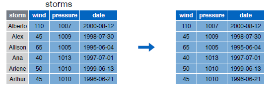
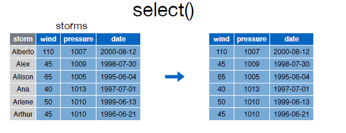

# select()

Lo primero sera instalar el paquete con el conjunto de datos que utilizaremos para los ejemplos:  


```r
install.packages("devtools")
devtools::install_github("rstudio/EDAWR")
```


Tendremos que cargar la libreria para poder utilizarla:  


```r
library(EDAWR)
```


Podemos echar un vistazo al conjunto de datos mediante __?__ or el comando __Viem()__:  


```r
?storms
?cases
?pollution
?tb
View(storms)
View(cases)
View(pollution)
View(tb)
```


Con la función select podemos seleccionar columnas de un data frame:  


  

Visualizamos el contenido del data frame __storms__:


```r
storms
```

```
## Source: local data frame [6 x 4]
## 
##     storm  wind pressure       date
##     (chr) (int)    (int)     (date)
## 1 Alberto   110     1007 2000-08-03
## 2    Alex    45     1009 1998-07-27
## 3 Allison    65     1005 1995-06-03
## 4     Ana    40     1013 1997-06-30
## 5  Arlene    50     1010 1999-06-11
## 6  Arthur    45     1010 1996-06-17
```

Para seleccionar las variables __storm__ y __pressure__ del data frame ejecutaremos la siguiente instrucción:  


```r
select(storms, storm, pressure)
```

```
## Source: local data frame [6 x 2]
## 
##     storm pressure
##     (chr)    (int)
## 1 Alberto     1007
## 2    Alex     1009
## 3 Allison     1005
## 4     Ana     1013
## 5  Arlene     1010
## 6  Arthur     1010
```


Con el guión __-__ podemos excluir una columna:  


  


```r
select(storms, -storm)
```

```
## Source: local data frame [6 x 3]
## 
##    wind pressure       date
##   (int)    (int)     (date)
## 1   110     1007 2000-08-03
## 2    45     1009 1998-07-27
## 3    65     1005 1995-06-03
## 4    40     1013 1997-06-30
## 5    50     1010 1999-06-11
## 6    45     1010 1996-06-17
```


Podemos utilizar la notación __:__ para seleccionar un rango de columnas:  


  


```r
select(storms, wind:date)
```

```
## Source: local data frame [6 x 3]
## 
##    wind pressure       date
##   (int)    (int)     (date)
## 1   110     1007 2000-08-03
## 2    45     1009 1998-07-27
## 3    65     1005 1995-06-03
## 4    40     1013 1997-06-30
## 5    50     1010 1999-06-11
## 6    45     1010 1996-06-17
```


Utilizando los operadores __-__ y __:__ de forma conjunta  podemos hacer cosas como estas:  


```r
select(storms, -(storm:wind))
```

```
## Source: local data frame [6 x 2]
## 
##   pressure       date
##      (int)     (date)
## 1     1007 2000-08-03
## 2     1009 1998-07-27
## 3     1005 1995-06-03
## 4     1013 1997-06-30
## 5     1010 1999-06-11
## 6     1010 1996-06-17
```


El paquete dplyr proporciona una serie de funciones que nos pueden facilitar mucho nuestro trabajo, como por ejemplo:  


```r
#Selecciona columnas cuyo nombre contiene un string
select(storms,starts_with("w"))
```

```
## Source: local data frame [6 x 1]
## 
##    wind
##   (int)
## 1   110
## 2    45
## 3    65
## 4    40
## 5    50
## 6    45
```


```r
#Selecciona columnas cuyo nombre termina con un string
select(storms, ends_with("e"))
```

```
## Source: local data frame [6 x 2]
## 
##   pressure       date
##      (int)     (date)
## 1     1007 2000-08-03
## 2     1009 1998-07-27
## 3     1005 1995-06-03
## 4     1013 1997-06-30
## 5     1010 1999-06-11
## 6     1010 1996-06-17
```


```r
#Selecciona todas las columnas
select(storms, everything())
```

```
## Source: local data frame [6 x 4]
## 
##     storm  wind pressure       date
##     (chr) (int)    (int)     (date)
## 1 Alberto   110     1007 2000-08-03
## 2    Alex    45     1009 1998-07-27
## 3 Allison    65     1005 1995-06-03
## 4     Ana    40     1013 1997-06-30
## 5  Arlene    50     1010 1999-06-11
## 6  Arthur    45     1010 1996-06-17
```


```r
#Selecciona columnas cuyo nombres contienen un string
select(storms, contains("essure"))
```

```
## Source: local data frame [6 x 1]
## 
##   pressure
##      (int)
## 1     1007
## 2     1009
## 3     1005
## 4     1013
## 5     1010
## 6     1010
```


A continuación mostramos un resumen de las funciones para __select__ que nos serán muy útiles:  


|        | *A partir de la tercera fila son funciones propias del paquete dply |
| :---: | :---: |
| __-__ | Selecciona todas las variables excepto|
| __:__ | Selecciona un rango |
| __contains()__ | Selecciona variables cuyo nombre contiene la cadena de texto |
| __ends_with()__ | Selecciona variables cuyo nombre termina con la cadena de caracteres |
| __everything()__ | Selecciona todas las columnas |
| __matches()__ | Selecciona las variables cuyos nombres coinciden con una expresión regular |
| __num_range()__ | Selecciona las variables por posición |
| __one_of()__ | Selecciona variables cuyos nombres están en un grupo de nombres |
| __start_with()__ | Selecciona variables cuyos nombres empiezan con la cadena de caracteres |


